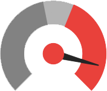

# STORM Dashboard

STORM Dashboard is team 2729's implementation of FRCDashboard. Some changes have been made to the overall structure in an overall attempt to make the dashboard more accessible to newer teams or students that don't know JavaScript/HTML.

## Setup and Build

You'll need [`nodejs`](https://nodejs.org) & [`npm`](https://npmjs.com).

Before running your dashboard, you'll need to install the node dependencies by `cd`ing into the dashboard directory and running `npm install`.

### Configuration/Sources

For more information on specific build details, visit the FRCDashboard Github page / repository.

## Authors

* [Erik Boesen](https://github.com/ErikBoesen) is the primary developer of FRC Dashboard.
* [Team 1418](https://github.com/frc1418) used earlier versions of this code in 2015 and 2016.
* [Leon Tan](https://github.com/lleontan) led the original 1418 UI team, coded pynetworktables2js, and developed a browser-based UI which was years later reworked to create FRC Dashboard.
* [Dustin Spicuzza](https://github.com/virtuald) leads the [RobotPy](https://github.com/robotpy) project mentored team 1418 through much of FRC Dashboard's genesis.
* [Tomas Rakusan](https://github.com/rakusan2) Developed Node based [NetworkTables client](https://github.com/rakusan2/FRC-NT-Client) and its interface in this project

## Licensing

This software is available under the [MIT License](`LICENSE`).
